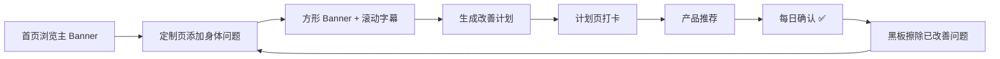

# 程序员健康助手 · 功能需求草案 v0.1

> 基于现有小程序结构（首页 / 计划 / 定制 / 我的），将产品想法整理为可评审、可排期的需求文档。  
> **本文档为需求说明，不涉及实现细节。**

---

## 1. 产品目标

帮助程序员以「**问题驱动**」的方式管理健康：

**声明/选择身体问题 → 获得个性化改善计划与产品推荐 → 通过打卡与提醒持续执行 → 每日确认后「擦除」已改善问题**

形成正向闭环。

**典型场景举例：** 胃疼、痛风、久坐、脱发、作息紊乱等。

---

## 2. 信息架构（页面层级）

```
首页（Tab）
├── 三大主 Banner（可扩展）
│   ├── 头发多多
│   ├── XX 身材（目标图 + 滚动提醒）
│   └── 体检广场
├── 小模块入口区
│   ├── 游戏记录
│   ├── 下班打卡
│   ├── 作息调整提醒
│   ├── 热量计算
│   └── 禁忌 / 过敏指南
└── 现有：健康模块、评分预览、提醒横幅

定制（Tab）—— 核心改造页
├── 大 Banner + 定制滚动字幕
├── 方形 Banner 区（用户自定义身体问题，可增删）
├── 黑板关键词区（现有 chalk 能力升级）
└── 生成计划 → 跳转计划 Tab

计划（Tab）
├── 改善打卡列表（现有）
├── 产品推荐模块（与 AI + 数据库联动）
└── 每日确认 ✅ → 触发黑板擦除逻辑

程序员健康自定义 / 上传报告（现有 report 或 home 模块）
└── 与「方形 Banner 问题」数据打通
```

---

## 3. 功能模块需求

### 3.1 方形 Banner · 自定义身体问题

| 项 | 说明 |
|---|---|
| **定位** | 用户主动声明当前身体问题（如：胃疼、痛风、腰肩痛、失眠） |
| **入口** | 「定制」Tab 为主；「程序员健康自定义」/ 首页模块为辅助入口 |
| **形态** | 方形卡片 Banner，支持添加 / 编辑 / 删除 |
| **内容** | 问题名称、可选严重程度、关联标签（饮食/作息/运动/用药） |
| **后续链路** | 问题 → 改善计划 habit → 产品推荐 → 打卡完成 |
| **规则** | 建议上限（如 3–7 个），避免信息过载 |
| **与现有关系** | 可视为「定制关键词 chalk」的结构化升级版；chalk 偏口语，Banner 偏明确问题 |

**用户故事：**

> 作为程序员，我想在定制页添加「痛风」「胃疼」，让系统为我生成对应的改善打卡和推荐，而不是只看通用的头发/身材模块。

---

### 3.2 大 Banner · 定制滚动字幕

| 项 | 说明 |
|---|---|
| **定位** | 定制页顶部视觉焦点，传达当前关注重点 |
| **形态** | 宽幅 Banner + 横向滚动字幕（marquee） |
| **字幕来源** | ① 用户选中的方形 Banner 问题；② 系统推荐关键词；③ AI 生成的今日一句提醒 |
| **交互** | 点击 Banner 可进入问题编辑；字幕可配置开关 |
| **与现有关系** | 升级现有 `ChalkBackground` 静态粉笔字 → 可配置、可滚动、与选中问题联动 |

---

### 3.3 三大主 Banner（首页，可扩展）

| Banner | 核心能力 | 备注 |
|---|---|---|
| **头发多多** | 脱发评估、护发方案、目标进度 | 对应现有「程序员头发健康」模块，升级为 Banner 形态 |
| **XX 身材** | 目标身材图、滚动提醒（如「今日未拉伸」） | 对应现有「健身定制」，需支持目标图上传/选择 |
| **体检广场** | 报告上传、指标解读、社区/内容聚合 | 对应现有「上传体检报告」，扩展为「广场」概念 |

**共性需求：**

- 支持后台配置新增 Banner（「可添加」）
- 每个 Banner 有：标题、副标题、封面图、跳转页、是否展示滚动提醒
- 滚动提醒与计划 / 提醒 / 打卡状态联动

**补充：** 首页除三大固定 Banner 外，需预留用户自定义方形 Banner 展示位（与定制页数据同步）。

---

### 3.4 产品推荐模块

| 项 | 说明 |
|---|---|
| **位置** | 计划 Tab 底部（现有 `ProductRecommendSection` 占位升级） |
| **触发** | 基于：用户身体问题 Banner、体检指标、打卡完成情况、禁忌过敏数据 |
| **展示** | 产品名、适用问题、理由说明、价格/链接（演示期可占位） |
| **与 AI 链接** | AI 根据用户画像生成推荐文案 + 排序；需说明「非医疗处方，仅供参考」 |
| **与数据库** | 见第 4 节 |

**用户故事：**

> 我添加了「痛风」，计划页应推荐低嘌呤饮食相关商品/服务，并解释为什么推荐。

---

### 3.5 小模块（首页次级入口）

| 模块 | 功能描述 | 优先级建议 |
|---|---|---|
| **游戏记录** | 记录每日游戏时长，与作息/护眼/久坐提醒联动 | P2 |
| **下班打卡** | 一键标记下班时间，触发休息/运动/停止进食提醒 | P1 |
| **作息调整提醒** | 基于实际下班/入睡时间，动态调整提醒 | P1 |
| **热量计算** | 输入饮食估算热量，服务减脂/控体重目标 | P2 |
| **禁忌 / 过敏指南** | 用户维护忌口清单；影响产品推荐与计划生成 | P1 |

---

### 3.6 黑板擦除 · 每日确认 ✅

| 项 | 说明 |
|---|---|
| **现有能力** | 定制页选关键词时有擦除动画 |
| **升级目标** | 与「每日打卡确认」绑定 |
| **逻辑** | 用户完成当日计划并点击「今日确认 ✅」→ 对应问题/关键词从黑板淡出擦除 |
| **状态** | 已擦除问题进入「已改善 / 观察中」列表，可重新添加 |
| **产品意义** | 可视化「问题被解决」的正反馈，而非仅勾选 habit |

**用户故事：**

> 我今天完成了所有与「胃疼」相关的打卡，点确认后，黑板上的「胃疼」被擦掉，让我感觉问题在减少。

---

## 4. 数据与 AI 需求

### 4.1 数据库（建议实体）

| 实体 | 主要字段 | 用途 |
|---|---|---|
| **UserProfile** | 昵称、职业、工时（已有） | 基础画像 |
| **BodyIssue** | id、名称、标签、severity、status（active/resolved） | 方形 Banner |
| **IssuePlanLink** | issueId、habitId、productId | 问题 ↔ 计划 ↔ 推荐 |
| **Product** | id、名称、适用标签、禁忌冲突、price、link | 产品推荐 |
| **AllergyTaboo** | 用户忌口、过敏源 | 推荐过滤 |
| **CheckInRecord** | 日期、habitId、completed | 打卡 |
| **DailyConfirm** | 日期、confirmedIssues[] | 黑板擦除 |
| **BannerConfig** | type(main/square)、排序、文案、图片、跳转 | 运营可配置 |
| **HealthReport** | 指标、上传时间（已有 mock） | 体检广场 |

### 4.2 AI 能力边界

| 场景 | AI 输入 | AI 输出 | 约束 |
|---|---|---|---|
| 问题 → 计划 | BodyIssue + 用户画像 + 体检指标 | 3–7 条 micro-habit | 不含诊断、不开药 |
| 问题 → 产品推荐 | 同上 + Product 库 + 禁忌 | 排序后的推荐列表 + 理由 | 过滤过敏/禁忌冲突 |
| 滚动字幕 | 当日打卡/提醒/问题 | 一句个性化提醒 | 长度限制、可人工兜底 |
| 热量/饮食 | 用户输入 | 估算 + 建议 | 标注估算误差 |

**免责声明（全局）：** 生活方式建议，不构成医疗诊断；异常指标需就医。

---

## 5. 与现有功能映射

| 产品想法 | 现有实现 | 改造方向 |
|---|---|---|
| 定制滚动字幕 | `ChalkBackground` + 关键词池 | 改为可配置 Banner + 滚动字幕 |
| 方形 Banner 问题 | `ChalkKeywordBoard` 选词 | 结构化 BodyIssue + 方形卡片 UI |
| 产品推荐 | `ProductRecommendSection` 占位 | 接 AI + Product 库 |
| 三大 Banner | `ModuleCard` × 3 | 升级为主 Banner 组件，支持配置 |
| 体检广场 | `pages/report` | 扩展为广场页（报告 + 内容） |
| 打卡计划 | `pages/plan` | 增加 issue 维度与每日确认 |
| 黑板擦除 | customize 擦除动画 | 绑定 DailyConfirm |

**现有 Tab 结构：**

- 首页：`pages/home/index`
- 计划：`pages/plan/index`
- 定制：`pages/customize/index`
- 我的：`pages/profile/index`

**相关现有组件/服务：**

- `ChalkBackground` / `ChalkKeywordPool` / `ChalkKeywordBoard`
- `ModuleCard` / `ProductRecommendSection`
- `services/mock.ts`（`generatePlanFromKeywords`、`KEYWORD_HABIT_MAP`）
- `pages/report/index`（体检报告上传）

---

## 6. 建议分期

### Phase 1 · MVP（2–3 周）

- 方形 Banner：增删改身体问题
- 大 Banner + 滚动字幕（规则生成，AI 可后置）
- 问题 → 计划生成（规则映射，类似现有 `KEYWORD_HABIT_MAP` 扩展）
- 计划页产品推荐（静态库 + 标签匹配）
- 每日确认 ✅ + 黑板擦除

### Phase 2

- 三大主 Banner 可配置化
- 目标身材图 + 滚动提醒
- 禁忌/过敏指南 + 推荐过滤
- 下班打卡 + 作息提醒联动

### Phase 3

- AI 推荐文案与计划生成
- 体检广场（内容/社区）
- 游戏记录、热量计算
- 后台 Banner / Product 管理

---

## 7. 待确认问题（评审前需拍板）

1. **「程序员健康自定义」与「定制 Tab」是合并还是两个入口？**  
   建议：合并到定制 Tab，首页只保留入口跳转。

2. **方形 Banner 与 chalk 关键词是替代还是并存？**  
   建议：Banner 为结构化问题，chalk 为快捷口语补充。

3. **「游戏记录」是记录什么？**  
   手游时长 / Steam / 自填？是否要与久坐、护眼联动？

4. **产品推荐是电商跳转还是纯信息展示？**  
   影响合规与接口设计。

5. **体检广场是否含 UGC/社区？**  
   还是仅报告解读 + 官方内容？

6. **每日确认是确认整个计划还是按问题逐个确认？**  
   影响擦除粒度。

7. **三大 Banner「可添加」是用户添加还是运营后台添加？**  
   倾向：运营配置 + 用户自定义方形 Banner。

---

## 8. 核心用户流程（闭环）



---

## 9. 给下一个 Agent 的使用说明

**建议引用方式：**

```
请基于 docs/程序员健康助手-功能需求草案-v0.1.md 实现 Phase 1 中的 [具体模块]。
```

**可优先细化的子文档（尚未创建）：**

- 方形 Banner 字段与交互稿
- 产品推荐 + 数据库表结构
- Phase 1 页面线框（定制 / 计划）

**当前代码基线（v0.1 文档编写时）：**

- 技术栈：Taro 4 + React 微信小程序
- 已有定制页关键词 → 计划生成链路
- 已有 habit 打卡、产品推荐占位、粉笔黑板 UI
- 图标系统：`IconBadge` + `constants/icons.ts` + habit PNG 资源

---

*文档版本：v0.1 · 状态：草案 · 下一步：评审待确认问题 → 选定 Phase 1 范围*
